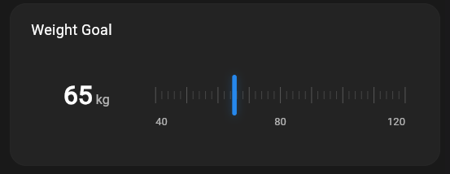
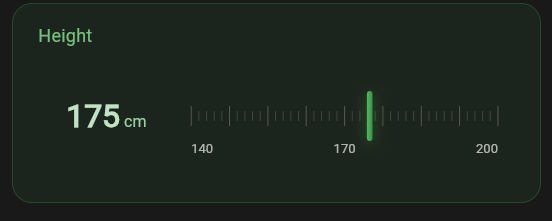
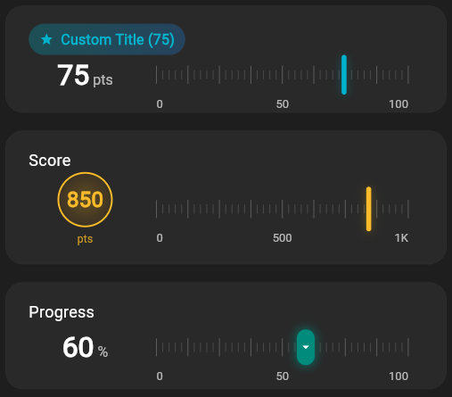

# Horizontal Gauge

A highly customizable and interactive horizontal gauge widget for Flutter applications with advanced theming, builder patterns, and smart boundary detection.

## ✨ Features

- 📊 **Interactive horizontal gauge** with smooth animations
- ✏️ **Touch & drag interaction** with smart boundary detection (500ms limit)
- 🎨 **Highly customizable themes** with gradient support
- 🔧 **Builder patterns** for complete component customization
- 📱 **Responsive design** that adapts to all screen sizes
- ⚡ **Performance optimized** with efficient rendering
- 🎯 **Professional tick system** with configurable marks
- 💎 **Modern Material Design** aesthetics
- 🔒 **Type-safe** with comprehensive documentation

## 🚀 Quick Start

### Installation

Add this to your package's `pubspec.yaml` file:

```yaml
dependencies:
  horizontal_gauge: ^1.0.0
```

Then run:

```bash
flutter pub get
```

### Basic Usage

Import the package:

```dart
import 'package:horizontal_gauge/horizontal_gauge.dart';
```

Simple gauge:

```dart
HorizontalGauge(
  title: 'Temperature',
  min: 0,
  max: 100,
  value: 25,
  unit: '°C',
  color: Colors.blue,
  onChanged: (value) {
    print('New value: $value');
  },
)
```

## 🎨 Advanced Customization

### Theme Customization

```dart
HorizontalGauge(
  title: 'Battery Level',
  min: 0,
  max: 100,
  value: 85,
  unit: '%',
  color: Colors.green,
  theme: HorizontalGaugeTheme(
    backgroundColor: Colors.green.withOpacity(0.1),
    borderColor: Colors.green.withOpacity(0.3),
    titleColor: Colors.green[300],
    valueColor: Colors.white,
    indicatorGradient: LinearGradient(
      colors: [Colors.green[400]!, Colors.green[600]!],
    ),
    backgroundGradient: LinearGradient(
      begin: Alignment.topLeft,
      end: Alignment.bottomRight,
      colors: [Colors.green.withOpacity(0.1), Colors.blue.withOpacity(0.1)],
    ),
  ),
  onChanged: (value) => setState(() => batteryLevel = value),
)
```

### Custom Builders

Create completely custom components:

```dart
HorizontalGauge(
  title: 'Score',
  min: 0,
  max: 1000,
  value: 850,
  unit: 'pts',
  color: Colors.amber,
  
  // Custom title with icon
  titleBuilder: (context, title, value) {
    return Container(
      padding: EdgeInsets.symmetric(horizontal: 12, vertical: 6),
      decoration: BoxDecoration(
        gradient: LinearGradient(colors: [Colors.amber.withOpacity(0.3), Colors.orange.withOpacity(0.3)]),
        borderRadius: BorderRadius.circular(20),
      ),
      child: Row(
        mainAxisSize: MainAxisSize.min,
        children: [
          Icon(Icons.star, color: Colors.amber, size: 16),
          SizedBox(width: 8),
          Text('$title (${value.round()})', style: TextStyle(color: Colors.amber, fontWeight: FontWeight.bold)),
        ],
      ),
    );
  },
  
  // Custom value display
  valueBuilder: (context, value, unit) {
    return Column(
      mainAxisAlignment: MainAxisAlignment.center,
      children: [
        Container(
          padding: EdgeInsets.all(12),
          decoration: BoxDecoration(
            shape: BoxShape.circle,
            gradient: RadialGradient(colors: [Colors.amber.withOpacity(0.3), Colors.orange.withOpacity(0.1)]),
            border: Border.all(color: Colors.amber, width: 2),
          ),
          child: Text(value.round().toString(), style: TextStyle(fontSize: 24, fontWeight: FontWeight.w900, color: Colors.amber)),
        ),
        SizedBox(height: 4),
        Text(unit, style: TextStyle(fontSize: 12, color: Colors.amber.withOpacity(0.8))),
      ],
    );
  },
  
  // Custom indicator
  indicatorBuilder: (context, value, min, max, color) {
    return Container(
      width: 20,
      height: 40,
      decoration: BoxDecoration(
        color: Colors.amber,
        borderRadius: BorderRadius.circular(10),
        boxShadow: [BoxShadow(color: Colors.amber.withOpacity(0.6), blurRadius: 8, spreadRadius: 2)],
      ),
      child: Icon(Icons.arrow_drop_down, color: Colors.white, size: 16),
    );
  },
  
  onChanged: (value) => setState(() => score = value),
)
```

## 📋 API Reference

### Core Parameters

| Parameter | Type | Description | Default |
|-----------|------|-------------|---------|
| `title` | `String` | The title displayed above the gauge | Required |
| `min` | `double` | Minimum value of the gauge | Required |
| `max` | `double` | Maximum value of the gauge | Required |
| `value` | `double` | Current value of the gauge | Required |
| `unit` | `String` | Unit text displayed with the value | Required |
| `color` | `Color` | Primary color of the gauge | Required |
| `onChanged` | `ValueChanged<double>?` | Callback when value changes | `null` |

### Layout & Styling

| Parameter | Type | Description | Default |
|-----------|------|-------------|---------|
| `height` | `double?` | Height of the gauge widget | Auto-calculated |
| `padding` | `EdgeInsetsGeometry?` | Internal padding | Auto-calculated |
| `borderRadius` | `double?` | Border radius of the container | Auto-calculated |
| `theme` | `HorizontalGaugeTheme?` | Complete theme configuration | `null` |

### Display Options

| Parameter | Type | Description | Default |
|-----------|------|-------------|---------|
| `showTicks` | `bool` | Show/hide tick marks | `true` |
| `showLabels` | `bool` | Show/hide value labels | `true` |
| `customTickCount` | `int?` | Custom number of tick marks | `41` |

### Builder Functions

| Parameter | Type | Description |
|-----------|------|-------------|
| `titleBuilder` | `TitleBuilder?` | Custom title widget builder |
| `valueBuilder` | `ValueBuilder?` | Custom value display builder |
| `indicatorBuilder` | `IndicatorBuilder?` | Custom indicator widget builder |
| `tickBuilder` | `TickBuilder?` | Custom tick marks painter |

### HorizontalGaugeTheme Properties

| Property | Type | Description |
|----------|------|-------------|
| `backgroundColor` | `Color?` | Background color |
| `borderColor` | `Color?` | Border color |
| `titleColor` | `Color?` | Title text color |
| `valueColor` | `Color?` | Value text color |
| `unitColor` | `Color?` | Unit text color |
| `tickColor` | `Color?` | Minor tick color |
| `majorTickColor` | `Color?` | Major tick color |
| `labelColor` | `Color?` | Label text color |
| `indicatorColor` | `Color?` | Indicator color |
| `indicatorShadowColor` | `Color?` | Indicator shadow color |
| `backgroundGradient` | `Gradient?` | Background gradient |
| `indicatorGradient` | `Gradient?` | Indicator gradient |
| `titleStyle` | `TextStyle?` | Title text style |
| `valueStyle` | `TextStyle?` | Value text style |
| `unitStyle` | `TextStyle?` | Unit text style |
| `labelStyle` | `TextStyle?` | Label text style |
| `indicatorWidth` | `double?` | Indicator width |
| `indicatorHeight` | `double?` | Indicator height |
| `tickHeight` | `double?` | Minor tick height |
| `majorTickHeight` | `double?` | Major tick height |
| `indicatorBorderRadius` | `BorderRadius?` | Indicator border radius |
| `indicatorShadows` | `List<BoxShadow>?` | Indicator shadows |

## 🎯 Key Features Explained

### Smart Boundary Detection
The gauge includes intelligent boundary detection that automatically stops dragging when the user reaches min/max values and holds for 500ms, providing intuitive user experience.

### Builder Pattern Architecture
Complete customization through builder functions:
- **TitleBuilder**: `(BuildContext context, String title, double value) → Widget`
- **ValueBuilder**: `(BuildContext context, double value, String unit) → Widget`
- **IndicatorBuilder**: `(BuildContext context, double value, double min, double max, Color color) → Widget`
- **TickBuilder**: `(Canvas canvas, Size size, double min, double max, double value, Size screenSize) → void`

### Responsive Design
All dimensions automatically adapt to screen size:
- Auto-scaling fonts and spacing
- Device-appropriate tick marks
- Optimized touch targets
- Consistent appearance across devices

## 🔧 Examples Gallery

### Standard Usage


```dart
HorizontalGauge(
  title: 'Weight Goal',
  min: 40.0,
  max: 120.0,
  value: 65.0,
  unit: 'kg',
  color: Colors.blue,
  onChanged: (value) {
    setState(() {
      weightValue = value;
    });
  },
)
```

### Colorful Theme


```dart
HorizontalGauge(
  title: 'Height',
  min: 140.0,
  max: 200.0,
  value: 175.0,
  unit: 'cm',
  color: Colors.green,
  theme: HorizontalGaugeTheme(
    backgroundColor: Colors.green.withOpacity(0.1),
    borderColor: Colors.green.withOpacity(0.3),
    titleColor: Colors.green[300],
    valueColor: Colors.green[100],
    unitColor: Colors.green[200],
    indicatorGradient: LinearGradient(
      colors: [Colors.green[400]!, Colors.green[600]!],
    ),
    indicatorShadows: [
      BoxShadow(
        color: Colors.green.withOpacity(0.5),
        blurRadius: 10,
        offset: const Offset(0, 3),
      ),
    ],
  ),
  onChanged: (value) {
    setState(() {
      heightValue = value;
    });
  },
)
```

### Custom Builders


```dart
// Custom Title Builder
HorizontalGauge(
  title: 'Custom Title',
  min: 0.0,
  max: 100.0,
  value: 75.0,
  unit: 'pts',
  color: Colors.cyan,
  height: 120,
  titleBuilder: (context, title, value) {
    return Container(
      padding: const EdgeInsets.symmetric(horizontal: 12, vertical: 6),
      decoration: BoxDecoration(
        gradient: LinearGradient(
          colors: [Colors.cyan.withOpacity(0.3), Colors.blue.withOpacity(0.3)],
        ),
        borderRadius: BorderRadius.circular(20),
      ),
      child: Row(
        mainAxisSize: MainAxisSize.min,
        children: [
          Icon(Icons.star, color: Colors.cyan, size: 16),
          const SizedBox(width: 8),
          Text(
            '$title (${value.round()})',
            style: const TextStyle(
              color: Colors.cyan,
              fontWeight: FontWeight.bold,
              fontSize: 16,
            ),
          ),
        ],
      ),
    );
  },
  onChanged: null, // Read-only
)

// Custom Value Builder
HorizontalGauge(
  title: 'Score',
  min: 0.0,
  max: 1000.0,
  value: 850.0,
  unit: 'pts',
  color: Colors.amber,
  height: 150,
  valueBuilder: (context, value, unit) {
    return Column(
      mainAxisAlignment: MainAxisAlignment.center,
      children: [
        Container(
          padding: const EdgeInsets.all(12),
          decoration: BoxDecoration(
            shape: BoxShape.circle,
            gradient: RadialGradient(
              colors: [
                Colors.amber.withOpacity(0.3),
                Colors.orange.withOpacity(0.1),
              ],
            ),
            border: Border.all(color: Colors.amber, width: 2),
          ),
          child: Text(
            value.round().toString(),
            style: const TextStyle(
              fontSize: 24,
              fontWeight: FontWeight.w900,
              color: Colors.amber,
            ),
          ),
        ),
        const SizedBox(height: 4),
        Text(
          unit,
          style: TextStyle(
            fontSize: 12,
            color: Colors.amber.withOpacity(0.8),
          ),
        ),
      ],
    );
  },
  onChanged: null, // Read-only
)

// Custom Indicator Builder
HorizontalGauge(
  title: 'Progress',
  min: 0.0,
  max: 100.0,
  value: 60.0,
  unit: '%',
  color: Colors.teal,
  height: 120,
  indicatorBuilder: (context, value, min, max, color) {
    return Container(
      width: 20,
      height: 40,
      decoration: BoxDecoration(
        color: Colors.teal,
        borderRadius: BorderRadius.circular(10),
        boxShadow: [
          BoxShadow(
            color: Colors.teal.withOpacity(0.6),
            blurRadius: 8,
            spreadRadius: 2,
          ),
        ],
      ),
      child: const Icon(
        Icons.arrow_drop_down,
        color: Colors.white,
        size: 16,
      ),
    );
  },
  onChanged: null, // Read-only
)
```

### Quick Examples

### Minimal Setup
```dart
HorizontalGauge(
  title: 'Volume',
  min: 0, max: 100, value: 75,
  unit: '%', color: Colors.blue,
  onChanged: (v) => print(v),
)
```

### With Custom Theme
```dart
HorizontalGauge(
  title: 'Progress',
  min: 0, max: 100, value: 60,
  unit: '%', color: Colors.green,
  theme: HorizontalGaugeTheme(
    backgroundGradient: LinearGradient(colors: [Colors.green.shade100, Colors.blue.shade100]),
    indicatorGradient: LinearGradient(colors: [Colors.green.shade400, Colors.green.shade600]),
    titleStyle: TextStyle(fontSize: 18, fontWeight: FontWeight.bold),
  ),
)
```

### Read-Only Display
```dart
HorizontalGauge(
  title: 'CPU Usage',
  min: 0, max: 100, value: 45,
  unit: '%', color: Colors.orange,
  onChanged: null, // Makes it read-only
)
```

### Custom Tick Configuration
```dart
HorizontalGauge(
  title: 'Speed',
  min: 0, max: 200, value: 120,
  unit: 'km/h', color: Colors.red,
  customTickCount: 21, // Custom tick count
  showLabels: false,   // Hide labels
)
```

## 🤝 Contributing

We welcome contributions! Here's how you can help:

1. **Fork** the repository
2. **Create** a feature branch (`git checkout -b feature/amazing-feature`)
3. **Commit** your changes (`git commit -m 'Add amazing feature'`)
4. **Push** to the branch (`git push origin feature/amazing-feature`)
5. **Open** a Pull Request

### Development Setup
```bash
git clone https://github.com/SpinexIO/horizontal_gauge.git
cd horizontal_gauge
flutter pub get
cd example
flutter run
```

## 📄 License

This project is licensed under the MIT License - see the [LICENSE](LICENSE) file for details.

## 🆘 Support & Community

- 📖 [Documentation](https://github.com/SpinexIO/horizontal_gauge/wiki)
- 🐛 [Issue Tracker](https://github.com/SpinexIO/horizontal_gauge/issues)
- ⭐ [GitHub Repository](https://github.com/SpinexIO/horizontal_gauge)

<div align="center">

**Made with ❤️ for the Flutter community**

If this package helped you, please consider giving it a ⭐ on GitHub!

</div>
